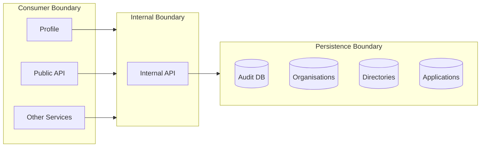
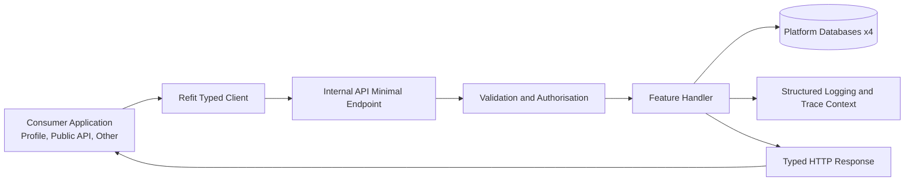
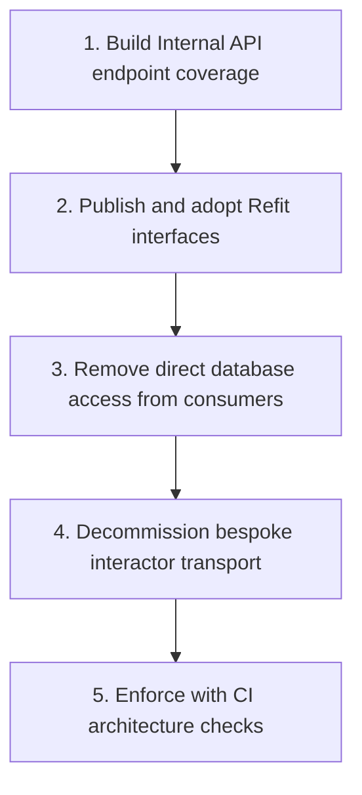

# Interactor Framework Spike Outcome

## Intent

This document captures the outcome of a spike to identify an alternative approach to the interactor framework and defines the architecture pattern to use for future feature delivery.

The core principle is that Internal API is the only component that talks to the databases. All other platform components call Internal API over HTTP through strongly typed clients.

## Background

The PoC was carried out to prove a simpler feature-delivery model than the bespoke interactor transport framework.

The interactor approach introduced extra transport and orchestration layers that made feature flow harder to follow end-to-end. The PoC showed that a Minimal API endpoint, implemented as a feature slice with explicit dependencies, gives a clearer delivery model while preserving the architectural boundaries we still want to keep.

## Architecture Boundaries



Boundary rule: only the Internal boundary can invoke persistence operations against the databases. Consumer applications access data through Internal API.

## Request Flow



1. A caller service invokes a Refit interface method.
2. Refit sends an authenticated request to Internal API.
3. Internal API validates the request and executes feature logic.
4. Internal API performs persistence operations.
5. Internal API returns a typed HTTP response.
6. The caller handles the result through the typed contract.

## Architectural Approach

### 1. Single Data Access Boundary

Internal API owns all reads and writes across the four platform persistence stores.

What this means in practice:

- EF DbContext-based data operations stay inside Internal API.
- Profile, Public API, and other callers do not query or mutate data stores directly.
- Data access behaviour is exposed through endpoint contracts, not shared data-access dependencies.

### 2. Feature-Oriented Minimal API Endpoints

Operations are modelled as feature endpoints rather than generic interaction transport handlers.

Endpoint design characteristics:

- A feature endpoint maps a clear business action (for example, change job title).
- Validation runs at endpoint boundary.
- Handler dependencies are explicit (DbContext, logger, and any required services).
- HTTP outcomes reflect business outcomes (success, no-op/idempotent, not found, validation failure).

This keeps behaviour close to the contract and makes each API path independently testable and observable.

### 3. Strongly Typed Consumer Integration via Refit

Consumers call Internal API via Refit interfaces. This gives a strongly typed integration model without requiring consumers to depend on transport-specific framework abstractions.

### 4. Contract-First Behaviour

Each endpoint defines an explicit API contract for input validation, response shape, and status behaviour.

Contract rules:

- Request/response DTOs are endpoint-aligned and intentionally scoped.
- Error behaviour is consistent and predictable for clients.
- Contract changes are treated as API evolution and managed deliberately.

### 5. Observability and Operational Consistency

The endpoint boundary is the operational control point for tracing, logging, and error handling.

Expected observability behaviour:

- Structured lifecycle logging at start, meaningful branch outcomes, and completion.
- Correlation context propagated through standard middleware and HTTP headers.
- Uniform telemetry semantics across feature endpoints.

### 6. Security and Trust Boundaries

Internal API is the enforcement boundary for service-to-service access.

Security posture:

- Caller services authenticate to Internal API.
- Endpoint-level authorisation applies business-level access rules.
- Consumers never receive direct persistence credentials or data-access dependencies.

## Vertical Slices and Clean Architecture

This architecture keeps Clean Architecture principles, but organises implementation by feature (vertical slices) rather than by broad technical layer.

Why this is still Clean Architecture:

- Business rules remain at the centre of each feature slice.
- External concerns (HTTP, persistence, auth, logging) remain implementation details at the boundary.
- Dependencies still point inward to feature/business behaviour, not outward to frameworks.
- Features remain testable in isolation with clear use-case intent.

What changes compared with a traditional layered implementation:

- Instead of spreading one feature across multiple cross-cutting folders/layers, each feature is grouped end-to-end.
- Endpoint, validation, handler logic, and contracts are co-located for that use case.
- Boilerplate orchestration layers are reduced where they do not add architectural value.

In short: vertical slices do not replace Clean Architecture. They are a practical way to apply it with simpler, feature-focused composition and less incidental complexity.

## Worked Example Pattern

The Change Job Title endpoint demonstrates the target design pattern:

- Feature-specific route mapped in Internal API.
- Explicit validation and OpenAPI metadata at mapping point.
- Handler-level injected dependencies and structured logging.
- Idempotent/no-op path handled explicitly.
- Persistence executed within Internal API before returning success.

How this has been applied in implementation:

- Endpoint class: `ChangeJobTitleEndpoint` in the feature slice.
- Route mapping: `MapPost(ApiRoutes.ChangeJobTitle, Handler)` with validation filter.
- Data access: `DbDirectoriesContext` is injected directly into the handler.
- Logging: structured start/no-op/success log events are emitted.
- Persistence: job title update is committed with `SaveChangesAsync`.

```csharp
public sealed class ChangeJobTitleEndpoint
{
	public static void Map(IEndpointRouteBuilder app)
	{
		app.MapPost(ApiRoutes.ChangeJobTitle, Handler)
			.WithValidationFilter<ChangeJobTitleRequest>();
	}

	public static async Task<IResult> Handler(
		DbDirectoriesContext dbDirectoriesContext,
		ILogger<ChangeJobTitleEndpoint> logger,
		[FromBody] ChangeJobTitleRequest query,
		CancellationToken cancellationToken)
	{
		// Feature logic and persistence live together in the slice.
	}
}
```

This is the implementation style to apply going forward.

## Benefits Compared with the Interactor Framework

- Clearer system boundaries: data access is centralised behind Internal API rather than spread across interactor call paths.
- Better contract clarity: endpoint-specific request/response contracts are easier to reason about than generic transport wrappers.
- Stronger consumer ergonomics: Refit provides typed, discoverable interfaces with less boilerplate.
- Simpler observability: endpoint boundaries provide a consistent place for logging, tracing, and status mapping.
- Lower coupling: consumers depend on API contracts instead of interactor framework internals.
- Easier governance: architecture checks can enforce "no direct database access outside Internal API" more reliably.
- Incremental delivery: feature endpoints can be added and validated independently.

## Testing Approach

- Feature behaviour is validated primarily through integration tests.
- Integration tests run against a real database, which gives higher confidence in endpoint, persistence, and contract behaviour together.
- Additional logic can be tested separately with unit tests where isolation gives faster or clearer feedback.
- Unit tests are optional and focused, used where they add value beyond integration coverage.

## Implementation Guardrails

To preserve the architecture after rollout:

- No new direct database access in non-Internal API projects.
- New data operations must be introduced as Internal API feature endpoints.
- Consumers integrate through Refit contracts, not bespoke transport abstractions.
- Endpoint behaviour includes validation, explicit status codes, and structured logs.

## Adoption Steps



1. Complete endpoint coverage in Internal API for required business operations.
2. Publish and adopt Refit interfaces in profile, Public API, and other consumers.
3. Remove direct data access from non-Internal API applications.
4. Decommission bespoke interactor transport paths once no traffic depends on them.
5. Enforce architecture with CI checks to prevent regression.
