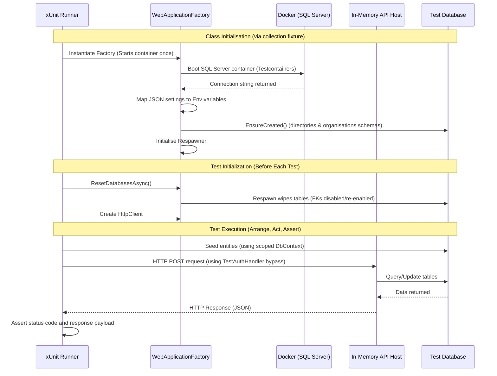

# DfE Sign-In Internal API Integration Testing Guide

This guide explains the purpose, architecture, and implementation details of the integration testing framework in the `Dfe.SignIn.InternalApi.IntegrationTests` project. Use this document as a reference for writing new integration tests and troubleshooting test environments.

---

## 1. Purpose of Integration Tests

While unit tests validate business logic in isolation by mocking all external dependencies, **integration tests** verify that the entire application stack works together correctly.

In the DfE Sign-In platform, integration tests ensure:
*   **Database Schema Compatibility**: Entity Framework Core mappings align perfectly with real SQL Server database schemas.
*   **API Route and Contract Validation**: HTTP endpoints are correctly mapped, accept the expected request payloads, and return correct response payloads.
*   **Security & Interception**: Custom middlewares, filters, logging contexts, and exception handling blocks function correctly in a real HTTP lifecycle.
*   **Resilience & DI Setup**: Dependency injection registrations resolve correctly without runtime exceptions during host startup.

---

## 2. How the Testing Flow Works

The framework spins up a lightweight, isolated SQL Server instance inside a Docker container, runs EF Core database schema creation, hosts the API in-memory, and executes tests against it.



---

## 3. Key Libraries Used

We utilize three main libraries to keep integration tests fast, isolated, and easy to maintain:

### 1. `Microsoft.AspNetCore.Mvc.Testing` (`WebApplicationFactory<T>`)
Hosts the API in-memory using a test-specific web server.
*   **Why**: It allows sending real HTTP requests to your endpoints and testing the full middleware pipeline without running a slow, external IIS or Kestrel process.

### 2. `Testcontainers.MsSql`
Provides lightweight, disposable SQL Server instances running in Docker.
*   **Why**: It avoids the need for a shared, local database server that could contain stale data. Each test run gets a 100% fresh, isolated SQL Server instance.

### 3. `Respawn`
Resets the state of database tables back to a blank schema.
*   **Why**: Dropping and recreating database schemas for every test takes seconds. Respawn queries the database metadata, disables foreign keys, deletes all data using `DELETE`/`TRUNCATE` statements, and re-enables constraints in **under 15 milliseconds**, ensuring total test isolation without a speed penalty.

---

## 4. How to Write a New Test

Follow these steps to add integration tests for a new endpoint:

### Step 1: Add a Test Class
Create a new test file under the `Endpoints/` folder. Use the following class template:

```csharp
using System.Net;
using System.Net.Http.Json;
using Dfe.SignIn.Core.Contracts.Organisations; // Replace with your request/response contracts
using Dfe.SignIn.Core.Entities.Organisations;  // Replace with your database entity models
using Dfe.SignIn.Gateways.EntityFramework;
using Dfe.SignIn.InternalApi.Contracts;
using Microsoft.Extensions.DependencyInjection;
using Xunit;

namespace Dfe.SignIn.InternalApi.IntegrationTests.Endpoints;

[Collection("IntegrationTestsCollection")]
[Trait("Category", "Integration")]
public class GetOrganisationByIdTests : IAsyncLifetime
{
    private readonly InternalApiWebApplicationFactory _factory;
    private readonly HttpClient _client;

    public GetOrganisationByIdTests(InternalApiWebApplicationFactory factory)
    {
        _factory = factory;
        _client = _factory.CreateClient();
    }

    public async Task InitializeAsync()
    {
        // Clear database state between tests
        await _factory.ResetDatabasesAsync();
    }

    public Task DisposeAsync() => Task.CompletedTask;

    [Fact]
    public async Task GetOrganisationById_ReturnsOrganisation_WhenExists()
    {
        // 1. Arrange: Seed your data using the scoped DbContext
        var orgId = Guid.NewGuid();
        var expectedName = "Test Academy Trust";
        
        await using var scope = _factory.Services.CreateAsyncScope();
        var dbContext = scope.ServiceProvider.GetRequiredService<DbOrganisationsContext>();
        dbContext.Organisations.Add(new OrganisationEntity
        {
            Id = orgId,
            Name = expectedName,
            Category = "001", // Required field for DB mapping
            Status = 1,       // Required field for DB mapping
            CreatedAt = DateTime.UtcNow,
            UpdatedAt = DateTime.UtcNow
        });
        await dbContext.SaveChangesAsync();

        var request = new GetOrganisationByIdRequest { OrganisationId = orgId };

        // 2. Act: Send request to the endpoint
        var response = await _client.PostAsJsonAsync("interaction/Organisations.GetOrganisationById", request);

        // 3. Assert: Verify response
        if (response.StatusCode != HttpStatusCode.OK)
        {
            var errorBody = await response.Content.ReadAsStringAsync();
            Assert.Fail($"Request failed with status {response.StatusCode}. Response: {errorBody}");
        }

        var body = await response.Content.ReadFromJsonAsync<InteractionResponse<GetOrganisationByIdResponse>>();
        Assert.NotNull(body);
        Assert.NotNull(body.Data);
        Assert.Equal(orgId, body.Data.Organisation.Id);
        Assert.Equal(expectedName, body.Data.Organisation.Name);
    }
}
```

### Step 2: Implement Common Seeding Helpers (Optional)
If you find yourself seeding the same entities (like a default user or organisation) across multiple test classes, create an extension class to reuse the code:

```csharp
public static class SeedExtensions
{
    public static async Task<Guid> SeedOrganisationAsync(this InternalApiWebApplicationFactory factory, string name)
    {
        var id = Guid.NewGuid();
        await using var scope = factory.Services.CreateAsyncScope();
        var context = scope.ServiceProvider.GetRequiredService<DbOrganisationsContext>();
        
        context.Organisations.Add(new OrganisationEntity
        {
            Id = id,
            Name = name,
            Category = "001",
            Status = 1,
            CreatedAt = DateTime.UtcNow,
            UpdatedAt = DateTime.UtcNow
        });
        
        await context.SaveChangesAsync();
        return id;
    }
}
```

---

## 5. Configuration & Under-The-Hood Details

### Minimal API Startup Limitation
In .NET 6+ Minimal APIs, using `ConfigureWebHost` to override configuration properties happens **after** `Program.cs` starts parsing `builder.Configuration`. Since the API project checks configuration keys immediately during bootstrap (`CreateBuilder(args)`), standard `WebApplicationFactory` configuration overrides are too late and cause "Section not found" exceptions.

### Solution: JSON-to-Environment Variable Mapping
We solve this by loading static test settings from [appsettings.IntegrationTests.json](file:///c:/Work/Playground/dsi-workspace/dsi-platform/tests/Dfe.SignIn.InternalApi.IntegrationTests/appsettings.IntegrationTests.json) (or custom test settings file defined by the factory) in the constructor and dumping them as process environment variables. 
The configuration binder translates double underscores (`__`) into colons (`:`), resulting in a perfect representation of configuration sections (e.g. `AzureAd__Audience` maps to `AzureAd:Audience`) which are processed in time by `Program.cs`.

---

## 6. Troubleshooting & Tips for Developers

### "An Application Control policy has blocked this file (0x800711C7)"
This occurs on corporate-managed laptops when Windows AppLocker blocks the execution/loading of DLLs in arbitrary folders (like `C:\Users\` or user sandbox folders).
*   **Fix 1**: Move/clone your workspace folder to a whitelisted developer directory, such as `C:\git\` or `C:\source\`.
*   **Fix 2**: Run tests inside **WSL 2** (Ubuntu/Linux terminal) where Windows AppLocker policies do not apply:
    ```bash
    dotnet test tests/Dfe.SignIn.InternalApi.IntegrationTests/Dfe.SignIn.InternalApi.IntegrationTests.csproj
    ```

### "Docker is either not running or misconfigured"
Testcontainers requires a running Docker daemon.
*   **Fix**: Ensure **Docker Desktop** is running. If Docker is active and the error persists:
    *   Disable **"Resource Saver Mode"** in Docker Desktop settings (known to freeze background container boot requests).
    *   If using WSL 2 backend, ensure integration is enabled for your current distro.

### Test execution is stuck at `StartAsync` / Taking too long
The first time integration tests run, Testcontainers has to pull the large Microsoft SQL Server image. Because it pulls the image silently over the Docker API, it looks like the test runner is frozen.
*   **Fix**: Run a manual pull in your terminal once to download the image with progress indicators:
    ```bash
    docker pull mcr.microsoft.com/mssql/server:2022-latest
    ```
    All subsequent runs will boot instantly since the image will be cached in your local Docker registry.
